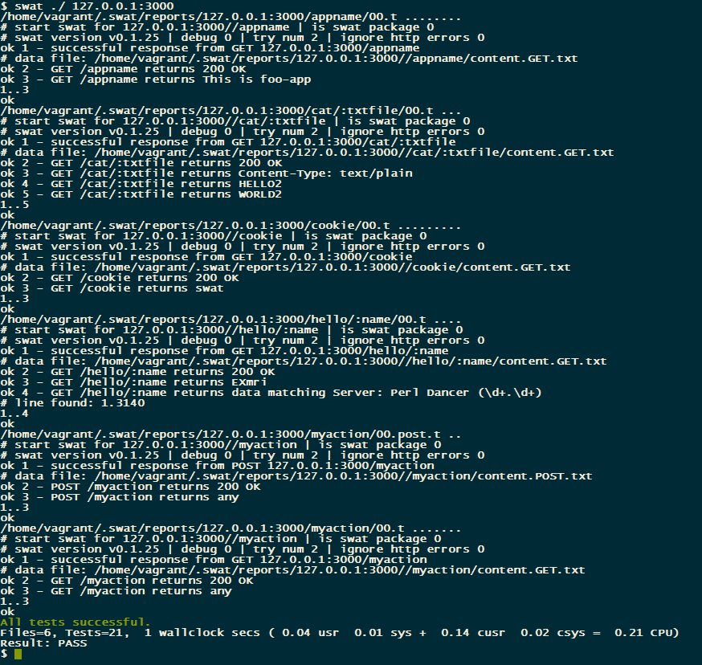

# SYNOPSIS

Swat tests for dancer app. This is sample dancer application and could be used as smoke tests target in various
CI processes, f.e. when running tests in travis.

# USAGE

## Install dancer

    $ cpan Dancer

## Run dancer  application

    $ perl ./app.pl
    
## Run swat tests

    $ swat ./ 127.0.0.1:3000    

