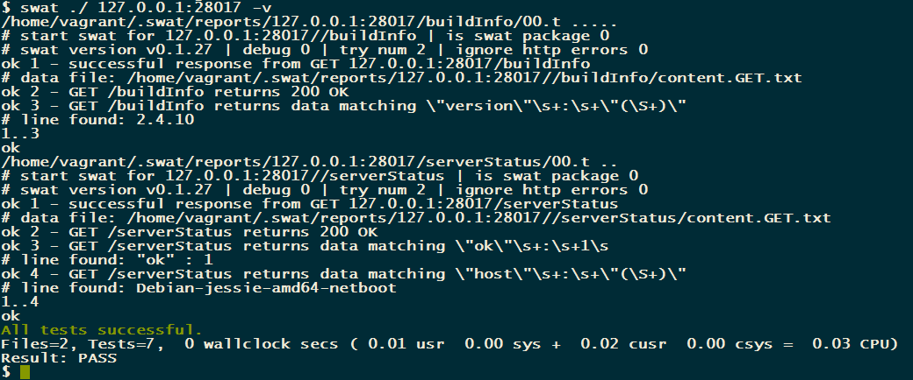

# SYNOPSIS

Swat tests for dancer app. This is sample dancer application and could be used as smoke tests target in various
CI processes, f.e. when running tests in travis.

# USAGE

## Install mongodb

    $ sudo apt-get install mongodb

## Run mongodb with --rest 

    $ sudo /etc/init.d/mongodb start
    
## Run swat tests

    $ swat ./ 127.0.0.1:28017    

